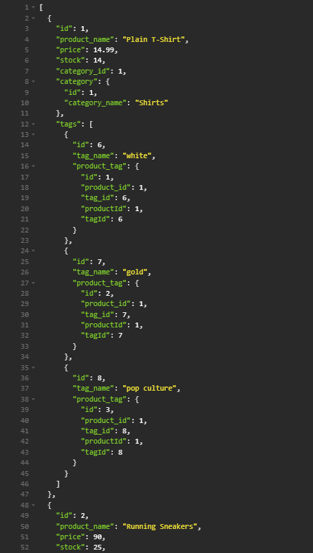

# E-Commerce-Back-End

## Description 

- This is an E-Commerce back end that uses Express.js, Sequelize to interact with a MySql database.

- Using Insomnia Core, you are able to test all of the GET, POST, PUT, and DELETE routes for the application.

## Functions

- Using this application you are able to use GET queries to retrieve all or one Category, Product or Tag.

- Using a POST query, you are able to create new data that will be able to reference to old data. For example, a new product but you are able to reference a old category.

- With all of the data, you are able to use PUT queries to be able to update each piece of data.

- With any unwanted data, you are able to use a DELETE query to remove it from your database.

## Usage

- First before starting the server you'll want to install all dependencies through the command-line with `npm i`.

- If you want to bulk create data for the database you'll have to use `npm run seed` in the command-line.

- Then, you'll be able to start the server with `npm start`.

- Using insomnia or something similiar like Postman you'll be able to make request to the server and it will preview all data.

## Sources

- [Sequlize validations](https://sequelize.org/docs/v6/core-concepts/validations-and-constraints/).

- Using [Include](https://gist.github.com/zcaceres/83b554ee08726a734088d90d455bc566) for queries.

## Demo Video

- You can watch the demo video [here](https://app.screencastify.com/v3/watch/PxCX96ONMPTdpbyl2gL7)